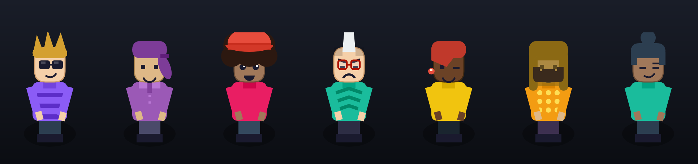
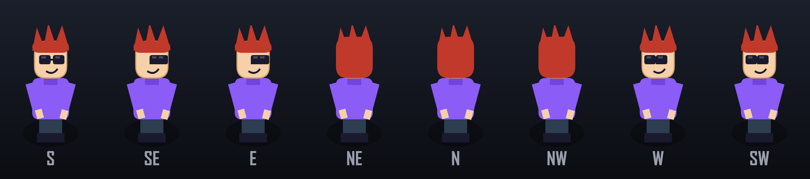
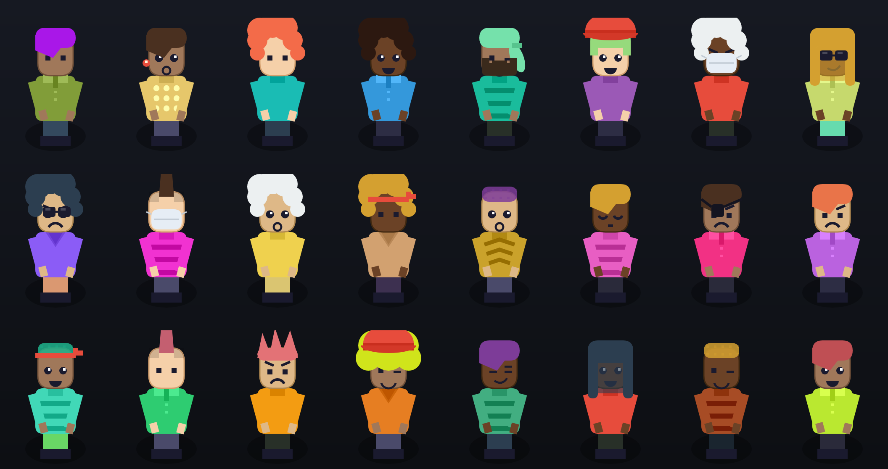
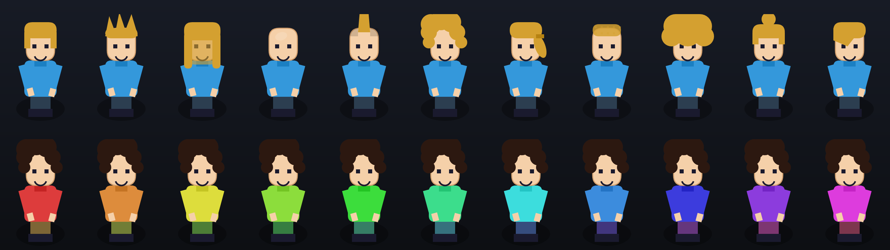

<div align="center">

# 🎮 2d_chars

### Procedural 2D character sprites for games — render them anywhere, design them in the browser.

No sprite sheets. No art pipeline. No dependencies. One `<script>` renders a fully
clothed, 8-directional character from a tiny JSON config — and a built-in editor lets
anyone create that config visually.

<br>



<br>

[**▶ Live demo & editor**](https://juanpe500.github.io/2d_chars/) &nbsp;·&nbsp;
[Quick start](#-quick-start) &nbsp;·&nbsp;
[Config schema](#-the-config-your-game-stores) &nbsp;·&nbsp;
[API](#-api)

  

</div>

---

## Why

You're building a game and you need characters — but you don't want to draw and slice
hundreds of sprite frames, and you *definitely* don't want to hand-author avatar data.

`2d_chars` gives you both halves:

- **`sprites.js`** — the renderer. Draws a character (body, clothes, hair, face,
  accessories, walk cycle, poses) onto any 2D canvas from a plain object. This is the
  only file your game ships.
- **`editor.js`** — an optional, self-contained character creator. Drop it on a page and
  players customize every option, preview all rotations and animations, and **export the
  exact config your game stores**. Import it back and you get a byte-for-byte identical
  character — so you *know* the round-trip works.

Everything is procedural canvas drawing. The whole thing is ~50 KB of vanilla JS with
zero dependencies and no build step.

---

## ✨ Features

- 🎲 **One-click random** avatars — great for NPCs, placeholders, or inspiration
- 🎨 **Everything is editable** — skin, hair style & color, face, accessory & color,
  shirt color & pattern, pants, shoes — free color pickers *and* curated palettes
- 🧭 **All 8 rotations** — the character turns; you see the back of the head, side profiles, everything
- 🚶 **Live animation** — walk cycle, sit / lay poses, auto-rotate preview
- 🔍 **Variations explorer** — sweep your character across every value of any axis
- 🖼️ **Random gallery** — browse two dozen looks, click one to edit it
- 💾 **Export / import** — JSON download, copy-paste, or a shareable `#link`
- 📦 **Standalone** — `editor.js` injects its own styles; no CSS or framework to wire up

---

## 🖼️ What it looks like

**All 8 rotations from a single config**



**Randomize — every look below is one JSON object**



**Customize — every hair style, and a live color sweep**



---

## 🚀 Quick start

Your game only ever needs `sprites.js` and the saved config:

```html
<script src="https://cdn.jsdelivr.net/gh/juanpe500/2d_chars@main/sprites.js"></script>
<canvas id="game" width="400" height="300"></canvas>
<script>
  const ctx = document.getElementById('game').getContext('2d');

  // whatever the editor exported and you stored:
  const avatar = { skin: 0, hair: 3, shirt: 7, hairStyle: 1, accessory: 2 };

  SpriteRenderer.drawAvatar(ctx, 200, 220, { avatar, direction: 'SE' });
</script>
```

Add the **editor** only on your character-creation page:

```html
<script src="https://cdn.jsdelivr.net/gh/juanpe500/2d_chars@main/editor.js"></script>
<div id="app"></div>
<script>
  new CharacterBuilder('#app', {
    onChange(avatar) {
      // this object is the whole character — persist it however you like
      localStorage.setItem('avatar', JSON.stringify(avatar));
    }
  });
</script>
```

That's the entire contract: **the editor produces an `avatar` object, your game feeds it
straight back to `SpriteRenderer.drawAvatar()`.**

---

## 🧩 The config your game stores

The exported `avatar` is a small, human-readable object. Indices pick from curated
palettes; the optional `custom*` hex fields override any color completely.

```jsonc
{
  "skin": 0,           // skin palette index (0–3)
  "hair": 3,           // hair color index (0–7)
  "shirt": 7,          // shirt color index (0–7)
  "pants": 0,          // pants color index (0–7)
  "hairStyle": 1,      // 0=short 1=spiky 2=long 3=bald 4=mohawk 5=curly
                       // 6=ponytail 7=buzz 8=afro 9=bun 10=emo
  "face": 3,           // 0=neutral 1=smile 2=happy 3=cool 4=wink 5=surprised 6=angry 7=sleepy
  "accessory": 2,      // 0=none 1=glasses 2=sunglasses 3=hat 4=headband
                       // 5=earring 6=mask 7=beard 8=eyepatch
  "shirtPattern": 1,   // 0=solid 1=stripes 2=vneck 3=collar 4=dots 5=chevron

  // optional free-color overrides (any #rrggbb):
  "customHair":  "#e91e63",
  "customShirt": "#1abc9c",
  "customPants": "#2d2d44",
  "customShoes": "#ffffff",
  "customSkin":  "#deb887",
  "customAccessory": "#f1c40f"
}
```

Any field can be omitted — missing values fall back to sensible defaults.

---

## 📚 API

### `SpriteRenderer.drawAvatar(ctx, x, y, player, isLocal?)`

Draws a character. `(x, y)` is the point on the ground the character stands on.

```js
SpriteRenderer.drawAvatar(ctx, x, y, {
  avatar,                    // the config object above
  direction: 'S',            // S SE E NE N NW W SW
  isWalking: true,           // animate the walk cycle
  walkFrame: frameCounter,   // increment over time to drive the animation
  pose: null,                // null | 'sit' | 'lay_down'
  username: 'Neo',           // optional name tag
});
```

### `new CharacterBuilder(container, options?)`

Mounts the full editor into `container` (an element or CSS selector).

| Option | Description |
| --- | --- |
| `onChange(avatar)` | called whenever the character changes |
| `initial` | an `avatar` object to start from |
| `syncHash` | set `false` to stop writing the config to `location.hash` |

Methods: `getConfig()` · `setConfig(avatar)` · `randomize()` · `reset()` · `destroy()`.

### `SpriteAvatar` helpers

`SpriteAvatar.render(canvas, avatar, opts)` · `.random()` · `.default()` ·
`.sanitize(obj)` · `.DIRECTIONS` · `.options` (the label tables for every axis).

---

## 🛠️ Run locally

It's fully static — no build. Just serve the folder:

```bash
git clone https://github.com/juanpe500/2d_chars
cd 2d_chars
python -m http.server 8000    # then open http://localhost:8000
```

---

## 📄 License

MIT — do whatever you like. See [`LICENSE`](LICENSE).
